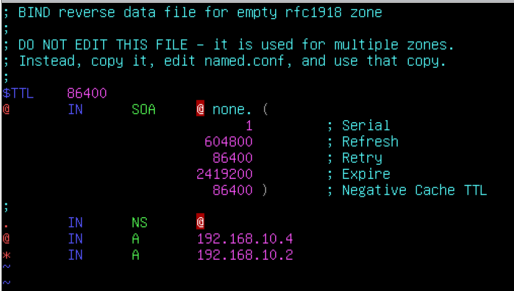
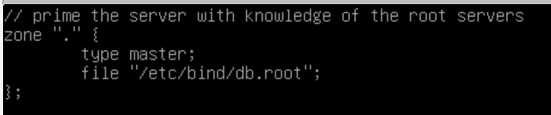

> 写在前面的小建议
>
> 拿到服务器首先记得修改主机名与 IP！
>
> vim 使用不习惯不用强求，没人拦着你用 nano
>
> 如果你是 vim 用户，记得在新系统里安装好 vim 软件包：`vim` `vim-common` `vim-scrtpts` `ctags`，会加快写配置文件的时间，事半功倍
>
> 防火墙放在最后配置，限制 SSH 访问策略也放在最后配置，但免密登录什么时候配都可以
>
> 可以把所有机器的 SSH 全部打开，在 Client 上 SSH 上去配置会快一点

# 登录

- Username：root
- Password：ChinaSkill20!
- Username：Chinaskill20
- Password：Chinaskill20!

除特别指定外，所有账号密码均为 `Chinaskill20!`

# 系统配置

- Region：China
- Locale：en_US.UTF-8
- KeyMap：English US

当任务为配置 SSL 或 TLS，如要求隐藏所有警告，请小心执行。

# 竞赛环境

物理机：

文件夹路径：

虚拟机:[datastore1] ( VMware ESXi )

ISO 镜像：[DATA]ISO/ ( VMware ESXi )

软件：D:\软件 ( Host )

# 项目任务描述

拓扑见样题

基本配置：

Device|Hostname|System|FQDN|IP Address|Service
-|-|-|-|-|-
Server01|Server01|预装 Linux|Server01.sdskills.com|172.16.100.201/25|DNS <br> Web <br> SSH <br> LDAP <br> DBMS 
Server02|Server02|待安装 Linux|Server02.sdskills.com|172.16.100.202/25|RAID5 <br> NFS <br> FTP <br> Mail <br> SSH <br> |
Server03|Server03|预装 Linux|Server03.skills.com|192.168.10.3/28|NTP <br> OpenVPN
Server04|Server04|待安装 Linux|Server04.skills.com|192.168.10.4/28|DNS <br> Web <br>
Rserver|Rserver|预装 Linux|Rserver.sdskills.com|172.16.100.254/25 <br> 192.168.10.2/28 <br> 10.10.10.254/24|firewall <br> DHCP <br> SSH <br> CA
Client|Client|Linux Desktop||10.10.100.x|none

网络：

Network|CIDR
-|-
office|10.10.100.0/24
service|172.16.100.128/25
internet|192.168.10.0/28


# Client Task

Client 已预装简易 Debian，要求如下：

- 要求能访问所有服务器，用于测试应用服务
- 为主机安装 GNOME 桌面环境
- 调整分辨率至 1280x768
- 测试 DHCP，IPv4 地址为自动获取
- 测试 DNS，安装 dnsutils 与 dig 命令行程序
- 测试 Web，安装 Firefox 浏览器，cUrl 命令行工具，在任何时候进行访问测试不允许弹出安全警告信息
- 测试 SSH，安装 SSH 命令行工具
- 测试 VPN 安装 VPN 客户端
- 测试 FTP，安装 FTP 客户端
- 测试文件共享，安装 Samba 命令行工具
- 测试 Mail，安装 Thunderbird，并能正常进行邮件收发
- 其他测试采用默认设定

## 题解

先配置主机名

```sh
$ hostnamectl set-hostname client
```

并且不要忘记修改 `hosts` 文件

```sh
$ vi /etc/hosts
```

默认的 vi 运行在 vi 兼容模式下，如果使用很别扭的话可安装 `vim` 软件包，或直接在 vi 中输入 `:set nocp` 关闭 vi 兼容模式。

将原来的主机名 `debian` 修改为新的主机名 `client`

此题目仅安装一堆软件包即可

但一部分题目需要后续做完其他服务器配置后返回来进行，所以这一阶段如果 Client 作为首题只能做一部分。

可以先安装所需软件包：

```sh
$ apt install gnome dnsutils firefox-esr curl openssh-client ftp thunderbird openvpn smbclient
```

安装完后 `reboot` 重启后进入桌面环境

```sh
$ reboot
```

桌面环境默认无法使用 `root` 账户登录，使用 `chinaskill20` 可登录进入桌面环境。

右键选择 `Display Settings`，打开显示器设置，将分辨率改为 1280x768

在配置后续机型时，会回来此机配置后续项目。

# Client Task

* 要求能访问所有服务器，用于测试应用服务
* 为主机安装 GNOME 桌面环境
* 调整显示分辨率为 1280x768
* 测试 DHCP，网卡 IPv4 地址为自动获取
* 测试 DNS，安装 dnsutils 与 dig 命令行工具
* 测试 Web，安装 Firefox 浏览器，curl 命令行测试工具，在任何时候进行访问测试时不允许弹出安全警告信息
* 测试 SSH，安装 SSH 命令行工具
* 测试 VPN，安装 OPENVPN 客户端工具软件
* 测试 FTP，安装 lftp 客户端工具
* 测试文件共享，安装 smbclient 客户端工具
* 测试 Mail，安装 Thunderbird，并能正常进行邮件收发
* 其他设定均采用默认设定

## 题解

安装桌面环境 

```sh
$ apt install gnome
```

重启即可


# Rserver Task

* Network
  * 请根据基本配置信息配置服务器主机名，网卡 IP 地址配置，域名等
  * 开启路由转发功能
* iptables
  * 默认阻挡所有流量
  * 添加必要的 NAT 规则，使 Office 和 Service 网络能够访问 Internet
  * 添加必要的规则以满足其他服务所需，禁止创建放行所有流量的规则
* DHCP
  * 为客户端分配 IP 范围为 10.10.100.1 - 10.10.100.50
  * 按照实际配置 DNS 与 GATEWAY
  * 配置 Client 固定获取 IP 地址为 10.10.100.51
* SSH
  * 安装 SSH 正常监听
  * 限制除 Client 以外的客户端登录，其他主机都应拒绝
  * 配置 Client 只能在 Chinaskills20 用户可以免密登录，端口为 2222，且具有 root 控制权限
* CA
  * CA 根证书路径 /CA/cacert.pem
  * 签发数字证书，签发者信息
    * 国家 = CN
    * 单位 = Inc
    * 组织机构 = www.skills.com
    * 公用名 = Skill Global Root CA

## 题解

### Network

首先查看网卡名称，使用 `ip link`

```sh
$ ip link
1: lo: (LOOPBACK,UP,LOWER_UP> mtu 65536 qdisc noqueue state UNKNOWN mode DEFAULT group default qlen 1000 
    link/loopback 00:00:00:00:00:00 brd 00:00:00:00:00:00 
2: ens192: <BROADCAST,MULTICAST> mtu 1500 qdisc noop state DOWN mode DEFAULT group default qlen 1000 
    link/ether 00:0c:29:a4:90:60 brd ff:ff:ff:ff:ff:ff 
2: ens224: <BROADCAST,MULTICAST> mtu 1500 qdisc noop state DOWN mode DEFAULT group DEFAULT qlen 1000 
    link/ether 00:0c:29:a4:90:Ba brd ff:ff:ff:ff:ff:ff 
4: ens256: <BROADCAST,MULTICAST> mtu 1500 qdisc noop state DOWN mode DEFAULT group default qlen 1000 
    link/ether 00:0c:29:a4:90:94 brd ff:ff:ff:ff:ff:ff
```

共三块网卡，分别按照对应网络设定。

编辑 `/etc/network/interfaces`

```sh
$ vi /etc/network/interfaces
```

```sh
auto ens192
iface ens192 inet static
address 172.16.100.254/25

auto ens224
iface ens224 inet static
address 10.10.100.254/24

auto ens256
iface ens256 inet static
address 192.168.10.2/28
```

接下来启用网卡

```sh
$ ifup ens192 ens224 ens256
```

配置主机名

```sh
$ hostnamectl set-hostname Rserver
```

修改 `/etc/hosts`,将 FQDN 写入 `hosts` 文件

修改 `127.0.1.1 debian` 这一行，修改为

```sh
127.0.1.1 Rserver.sdskills.com Rserver
```

打开内核的 IPv4 转发，编辑 `/etc/sysctl.conf`，28 行处的 `net.ipv4.ip_forward=1` 去掉前面的注释，保存文件。

使配置文件生效

```sh
$ sysctl -p
```

这台电脑实际上要作为拓扑中的接入路由器来使用，因此后续的网关设备全部指定此计算机

FQDN 在 Linux 上是通过 DNS 解析实现的，验证配置使用 `hostname -f`

## iptables

这道题做出来的不多，我怀疑应该是没看懂题目。

这个实验环境是将 `192.168.10.0/28` 网段看作公有 Internet，将 `service` 以及 `office` 接入互联网，因此应在 Rserver 配置 NAT 使其通过 Rserver 的 IP 地址接入互联网，能理解到这个程度那么做起来也就不难了。

iptables 配置最烦人的点就是必须按顺序将防火墙规则写进 iptables 配置中，一旦写错就要清除配置重来，不像现在的 firewalld 是并行处理的，所以实际使用的时候先全部放行，等待全部配置完成之后再来思考防火墙规则可能更好。

比较方便的方法是写一个配置规则的 Shell 脚本，这样后续修改起来会相对方便。

```sh
#!/bin/bash

# 待补全

# 清除现有规则
iptables -F
iptables -X
iptables -Z

# 设定默认规则
iptables -P INPUT DROP
iptables -P OUTPUT DROP
iptables -P FORWARD DROP

# 设定规则
iptables -A INPUT -i lo -j ACCEPT # 放行所有本机流量
iptables -A INPUT -m state --state RELATED,ESTABLISHED -j ACCEPT # 放行状态流量
iptables -A INPUT -i ens224 -p tcp -dport 2222 -j ACCEPT # 放行 SSH 流量

```

## DHCP

安装软件包 `isc-dhcp-server`

```sh
$ apt install isc-dhcp-server
```

没有做配置的情况下，安装时会提示服务无法启动，这是正常的。

要修改的文件有 `/etc/default/isc-dhcp-server` 与 `/etc/dhcp/dhcpd.conf`

首先修改 `/etc/default/isc-dhcp-server` 指定监听网卡

```sh
INTERFACESv4="ens224"
```

接下来编辑 `/etc/dhcp/dhcpd.conf`

在文件 50 行处有一个写的较完整的示例配置，可以直接复制使用

```sh
subnet 10.10.100.0 netmask 255.255.255.0 {
  range 10.10.100.1 10.10.100.50;
  option domain-name-servers 172.16.100.201;
  option domain-name "sdskills.com";
  option routers 10.10.100.254;
  option broadcast-address 10.10.100.255;
  default-lease-time 600;
  max-lease-time 7200;
}

host client {
  hardware ethernet 00:0c:29:4c:e3:a7;
  fixed-address 10.10.100.51;
}
```

其中，client 的 MAC 地址可通过在 Client 上使用 `ip link` 查看

启动服务，并确保开机启动

```sh
$ systemctl start isc-dhcp-server
$ systemctl enable isc-dhcp-server
```

## SSH

每次修改配置文件时，使用 `systemctl reload ssh` 使配置生效

编辑 `/etc/ssh/sshd_config`

修改 Port 为 2222

临时修改 PermitRootLogin 为 yes

拷贝 SSH key

```sh
# 在 Client 上
$ ssh-keygen
# 无脑回车
$ ssh-copy-id root@10.10.100.254 -p 2222
# 先在 Rserver 端允许 Root 账户登录，后再修改回来
```

编辑 `/etc/hosts.deny` 来限制登录

```sh
sshd:ALL except 10.10.100.51:deny
# 意为除去 10.10.100.51 主机以外的其他所有主机均禁止访问本机的 SSH 服务
```

确保服务开机启动

```sh
$ systemctl start ssh
$ systemctl enable ssh
```

## CA

在配置 CA 之前，确保当前时间正确，时区正确，最好先配置 NTP 服务器再回来配置 CA

修改 `/usr/lib/ssl/openssl.cnf`

第 28 行处，修改根目录为 `/CA`

创建子目录：

```sh
$ cd /CA
$ mkdir newcerts certs crl private
```

并创建两个文件：

```sh
$ touch ./index.txt
$ echo 1000 > serial
```

生成根证书私钥

```sh
$ openssl genrsa -out private/cakey.pem 4096
```

使用上一步生成的私钥签发证书：

```sh
$ openssl req -x509 -new -key /CA/private/cakey.pem -out /CA/cacert.pem
```

# Server01

## Network

配置 IP 与主机名跟上面方法相同，不多赘述

## DNS

Debian 将 Bind 的配置文件分成了很多份

对于 DNS 转发器，修改 `/etc/bind/named.conf.options`,文件中有一段被注释掉的 forwarders,取消注释后修改即可

将正向与反向解析配置放进 `/etc/bind/named.conf.local`，如下:

```sh
zone "sdskills.com" {
  type master;
  file "/etc/bind/db.sdskills.com";
};

zone "100.16.172.in-addr.aroa" {
  type master;
  file "/etc/bind/db.172.16.100";
};
```

不要忘记末尾的分号！

接下来创建区域文件，从已有的区域文件复制修改即可

```sh
$ cp /etc/bind/db.local /etc/bind/db.sdskills.com
$ cp /etc/bind/db.127 /etc/bind/db.172.16.100
```

将 SOA 修改为自己的域名 ( 注意域名后的点！ )

添加自己需要的记录即可

使用 named-checkconf 和 named-checkzone 来检查语法格式是否正确

```console
root@Server01:~# named-checkconf
root@Server01:~# named-checkzone sdskills.com /etc/bind/db.sdskills.com
zone sdskills.com/IN:  loaded serial 2
OK
root@Server01:~#
```

当前的 Bind 版本默认只允许本地与已知的本地局域网访问服务器进行查询，因此需要修改配置文件，改回以前的放行模式：

修改 `/etc/bind/named.conf.options`，在后面增加三行：

```sh
options {
     ...
     allow-recursion { any; };
     allow-query { any; };
     allow-query-cache { any; };
     ...
 };
 ```

放行所有主机。

## apache

题目中需要使用 LDAP 做认证，配置完 LDAP 后再来

```sh
apt install apache2
```

新建 `webuser` 用户，指定为系统用户并禁止登录

```sh
$ useradd -r webuser -s /sbin/nologin
```

修改 `/etc/apache2/envvars`

将指定运行用户与组的变量修改

```sh
export APACHE_RUN_USER=webuser
export APACHE_RUN_GROUP=webuser
```

网站目录放在 NFS 共享中，先做 Server02 再回来

挂载 `/data/share`

写入 `/etc/fstab`

```sh
172.16.100.202:/data/share  /data/share  nfs  defaults,_netdev  0  0
```

```sh
$ mount -a
```

写 index.sh

```sh
$ mkdir /data/share/webroot
$ vim /data/share/webroot/index.sh
```

```sh
#!/bin/bash
# This is index.sh
echo "Content-type: text/html"
echo ""
echo "Current System Time is: $(date +"%F %r")"
```

修复目录权限，并使脚本可执行

```sh
$ chown -R webuser:webuser /data/share/webroot
$ chmod 775 /data/share/webroot/index.sh
```

配置 Apahce，使 CGI 脚本可执行，并允许处理 Shell 脚本

```sh
$ vim /etc/apache2/conf-enabled/security.conf
```

```xml
<Dictory "/data/share/webroot">
    AllowOverride None
    Options +ExecCGI -MultiViews
    AddHandler cgi-script .cgi .sh .pl
    Require all granted
</Directory>
```

配置虚拟主机们，加上 SSL。

签发证书

```sh
$ openssl req -new -key Server01.pem -out http.csr
$ openssl ca -in http.csr -out http.pem
```

将证书传回 Server01 后，修复权限并放在对应目录

```sh
chmod 777 *.pem
cp http.pem /etc/ssl/certs/http_sdskills_com.pem
```

Apache 提供了 SSL 的虚拟主机模板，在 `/etc/apache2/sites-available/default-ssl.conf

将这个文件复制一份，然后修改

```sh
cp /etc/apache2/sites-available/default-ssl.conf /etc/apache2/sites-available/www.sdskills.com.conf
vim /etc/apache2/sites-available/www.sdskills.com
```

原文件内容很多，只截取需要注意的部分

```xml
<VirtualHost _default_:443>
    ServerName www.sdskills.com
    ServerAlias *.sdskills.com
    DocumentRoot /data/share/webroot

    SSLEngine On

    SSLCertificateFile /etc/ssl/certs/http_sdskills_com.pem
    SSLCertificateKeyFile /etc/ssl/certs/Rserver.key
</VirtualHost>
```

启用 SSL 模块，启用刚才修改的网站配置文件

```sh
$ a2enmod ssl
$ a2ensite www.sdskills.com.conf
```

修改原始默认网站文件，将 80 端口访问重定向到 HTTPS

```sh
$ vim /etc/apache2/sites-enabled/000-default.conf
```

```xml
<VirtualHost *:80>
    ServerName www.sdskills.com
    ServerAlias *.sdskills.com
    # 把原有配置注释
    # DocumentRoot /var/www/html

    # 加入
    redirect permanent / https://www.sdskills.com/
</VirtualHost>
```

### 配置 LDAP 验证

修改刚才写好的 /etc/apache2/conf-enabled/security.conf

```xml
<Dictory "/data/share/webroot">
    AllowOverride None
    Options +ExecCGI -MultiViews
    AddHandler cgi-script .cgi .sh .pl
    # 增加
    AuthType basic
    AuthBasicProvider ldap
    AuthLDAPUrl "ldaps://localhost/ou=People,dc=sdskills,dc=com"
    AuthName LDAP
    # 注释掉这行，重写
    #Require all granted
    Require valid-user
</Directory>
# 在外面增加
LDAPVerifyServerCert off
```


### MariaDB

```sh
$ apt install mariadb-server
$ mysql_secure_installation
```

增加一个超级用户用于网页端管理，新版的 MariaDB 与 MySQL 已不允许用户使用 root 在命令行以外的场合登录

```sh
$ mariadb -uroot -p
```

```sql
CREATE USER '新用户'@'%' IDENTIFIED BY '新用户的密码';
GRANT ALL PRIVILEGES ON *.* TO '新用户'@'%' WITH GRANT OPTION;
```

接下来托管 phpMyAdmin 即可使用新创建的用户登录

### PHP

```sh
$ apt install php libapache2-mod-php php-mysql
```

托管 phpMyAdmin 需要安装 `php-xml` 模块

```sh
$ apt install php-xml
$ systemctl restart apache2
```

将网站文件复制后确认权限正确

```sh
$ chown -R webuser:webuser /data/share/htdocs
```

## SSH

几乎同理，参照 Rserver 配置

## LDAP

安装配置 LDAP 前，先创建好需求的 100 个用户

这个肯定不能手敲，所以上 Shell 脚本:

```sh
#!/bin/bash
# 在一个等宽的 100 个数中循环
for i in $(seq -w 100)
do
  # 新建用户
  useradd lduser$i
  # 给用户设置密码
  echo "lduser$i:Chinaskill20!" | chpasswd
done
```

红帽系可以使用 `passwd --stdin` ，但 Debian 的 `passwd` 不支持这个参数，所以需要使用另一个工具 `chpasswd`

脚本写完，保存为 useradd.sh，赋予执行权限直接运行，或者：

```sh
$ bash useradd.sh
```

安装 slapd 与 migrationtools

```sh
$ apt install slapd migrationtools
```

并配置 `slapd`

```sh
$ dpkg-reconfigure slapd
```

修改 `/etc/migrationtools/migrate_common.ph`,将原有域名改成需求的 `dc=sdskills,dc=com`

migrationtools 脚本有一个 bug，由于 Debian 没有将文件放在该放的位置导致脚本找不到 migrate_common.ph 文件而报错。

进入脚本的存放目录

```sh
$ cd /usr/share/migrationtools
```

修复发行版的一个 Bug，链接 `migrate_common.ph` 到 `/etc/perl`

```sh
$ ln -s /etc/migrationtools/migrate_common.ph /etc/perl
```

运行 `migrate_all_online.sh` 将本地信息合并进 LDAP

```sh
$ LDAPADD="/usr/bin/ldapadd -c" ETC_ALIASES="/dev/null" ./migrate_all_online.sh
```

其中，手动指定 `ldapadd` 命令的 -c 参数使其忽略错误，根据 Debian 文档指定 ETC_ALIASES 变量来避免一个错误

| Question | Answer |
| --- |  --- |
| X.500 naming context | `dc=sdskill,dc=com` |
| LDAP server hostname | `localhost` |
| Manager DN | `cn=admin,dc=sdskill,dc=com` |
| Bind credentials | 输入密码 |
| Create DUAConfigProfile | no |

生成证书私钥与证书签发请求

```sh
$ openssl genrsa -out Rserver.pem 4096
$ openssl req -new -key Rserver.pem -out ldap.csr
```

在 Rserver 上给证书签名

```sh
$ openssl ca -in ldap.csr -out ldap.pem
```

将证书传回 Server01

给证书文件赋予权限：

```sh
$ chmod 777 *.pem
```

本例中所有证书存放在 `/root` 下

将 CA 根证书，Server01 的私钥，以及 LDAP 证书存放至 `/etc/ssl/certs/`

配置 LDAP config，加入证书位置

```sh
$ apt install ldapvi
$ ldapvi -Y EXTERNAL -h ldapi:/// -b cn=config
```

在 cn=config

```sh
olcTLSCACertificateFile: /etc/ssl/certs/Skill_Root_Global_CA.pem
olcTLSCertificateKeyFile: /etc/ssl/certs/Rserver.key
olcTLSCertificateFile: /etc/ssl/certs/Rserver_ldap.pem
```

保存退出，按 `y` 确认修改

修改 `/etc/default/slapd` 打开 `ldaps://` 监听

```sh
$ vim /etc/default/slapd
```

```sh
SLAPD_SERVICES="ldaps:/// ldapi:///"
```

# Server02

## Network 

大同小异，不再赘述

## Disk ( Raid5 )

```sh
$ apt install mdadm
```

添加硬盘

```sh
$ mdadm -Cv /dev/md0 -l 5 -n 3 -x 1 /dev/sdb /dev/sdc /dev/sdd /dev/sde
```

| 参数 | 说明 |
|-|-|
| `-C` | 创建软件 RAID
| `-v` | 显示详细信息
| `-l` | 指定阵列类型，此处为 RAID 5
| `-n` | 指定使用几块硬盘，不算备份盘 
| `-x` | 指定使用几块硬盘作为备份

创建 LVM

```sh
# 安装逻辑卷管理工具
$ apt install lvm2
# 创建卷组与逻辑卷
$ vgcreate /dev/vg01 /dev/md0
$ lvcreate -l 510 -n lv01 /dev/vg01
# 使用 ext4 格式化
$ mkfs.ext4 /dev/vg01/lv01
```

写入 /etc/fstab 实现自动挂载

```sh
$ mkdir /data
$ vim /etc/fstab
```

写入

```sh
$ /dev/vg01/lv01    /data    ext4    defaults    0  0
```

```sh
$ mount -a
```

## NFS

```sh
apt install nfs-kernel-server
```

修改 `/etc/exports`

```sh
/data/share  172.16.100.128/25(rw,sync,no_subtree_check)
```

重启服务

```sh
systemctl restart nfs-kernel-server
```
# Server04
关于 DNS 解析的第三问

DNS 根这么写

  

DNS 默认配置文件 /etc/bind/named.conf.default-zones 修改根域名部分

即一个点

  

