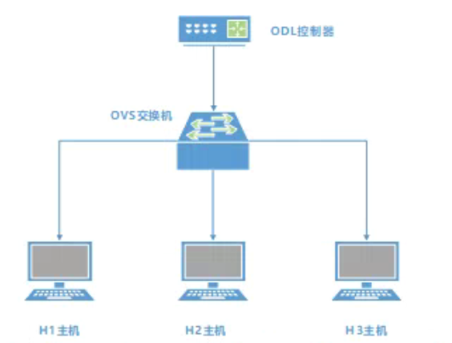
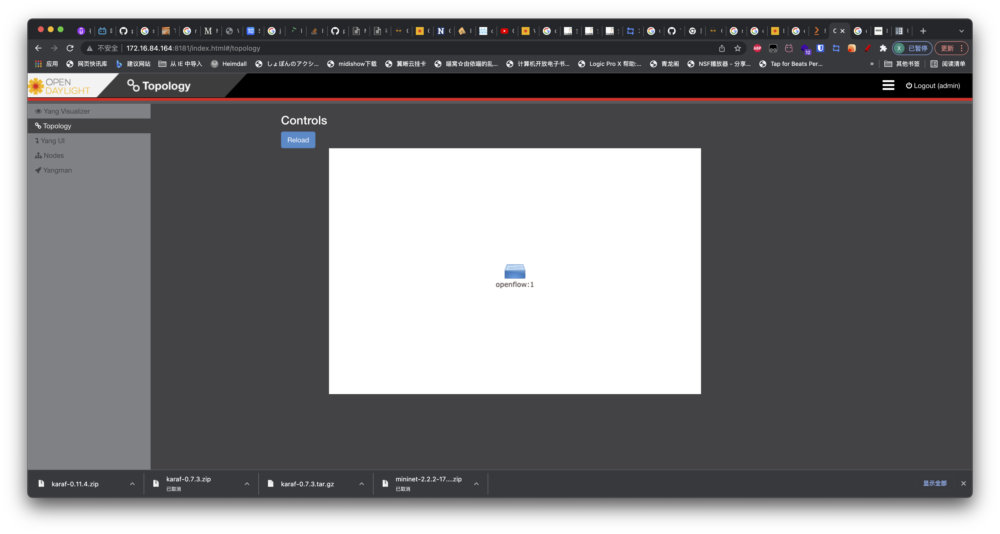

# SDN

2022 年国赛中新增了 SDN 部分，样题要求出现了使用 mininet 搭建简单的 SDN 拓扑。

既然对 SDN 有了考察，并且比赛文件中出现了 Virt-Manager 软件，我大胆预测近年的比赛会增加对 KVM 虚拟化的考察。

由此可以推论，部署 KVM 虚拟机，将其网络挂载到 OVS 一类的考题也是完全可能出现的。

这些都是题外话，我们来一起看一下本次的样题中出现的 SDN 考察项目。

## 介绍

### OpenDaylight

OpenDayLight 是多家网络厂商联合，社区驱动的一款开源的 SDN 控制器，他支持 Rest API 风格的北向接口，支持 `Yang`, `NetConf`, `OpenFlow` 等多种风格的南向接口，是当今开源 SDN 解决方案的主力军。

### OpenVSwitch

OpenVSwitch 是一个开源的，社区驱动的，兼容 OpenFlow 协议，支持主要 L2 功能的开源交换机组件。OpenVSwitch 的开发是对标 VMware 分布式虚拟交换机，和 Cisco Nexus 1000V 而设计的，因此被大量应用在开源 IaaS 平台中，例如 OpenStack 等，开源高性能网络方案 DPDK 也移植了 OVS 部分，称作 OVS-DPDK，是当今 Linux 下高性能数据中心网络的主流解决方案。

### mininet

mininet 是一个轻量级的网络平台，利用 mininet 可以快速创建拓扑，进行 SDN 的实验。

## Lab

先来看实验要求与拓扑

### Requirements

- 安装opendaylight、mininet、Ovs软件平台。。
- 启动OpenDayLight的karaf程序，安装如下组件：odl-restconf、odl-l2switch-switch-ui、odl-mdsal-apidocs、odl-dluxapps-applications。
- 使用Mininet和OpenVswitch构建拓扑，连接ODL的6653端口如下拓扑结构：



- 在浏览器上可以访问ODL管理页面查看网元拓扑结构。
- 通过OVS手工下发流表，H1可以ping通H3，H1、H3无法ping通H2。
- H1启动HTTP-Server功能，WEB端口为8080，H3作为HTTP-Client，获取H1的html网页配置文件。

### Solution

#### 安装 mininet

DLBD 1 里没有 mininet，但实际网络源里是有的，也许在 DLBD 2 里会有

我安装的时候使用的是网络源

尽管赛题里，这个节点是在 CentOS 运行的，但我认为在 CentOS 上考这道题的可能性很小。

这道题不可能放在 CentOS 上做，CentOS 必须从源码安装，mininet 也没有给出对 CentOS 的明确支持。连 mininet 的安装脚本也没有支持 CentOS，CentOS 也没有 OpenVSwitch 的包。

换句话说，如果这道题要在 CentOS 完成，不但所有依赖包都要从源码编译，而且也不保证可用性，而使用 Debian 则会很简单

```sh
$ apt install mininet
# openvswitch 会作为 mininet 的依赖安装
```

#### 部署 OpenDayLight

提醒一句，OpenDayLight 版本太新是没有所需的功能的，最高只能使用 0.7.3 即 Nitrogen 版本

下载地址为 [这里](https://nexus.opendaylight.org/content/repositories/opendaylight.release/org/opendaylight/integration/karaf/0.7.3/karaf-0.7.3.tar.gz)

上传 OpenDayLight 到主机，解压

```sh
$ tar -xvf karaf-0.7.3.tar.gz
```

OpenDaylight 使用 Java，先安装 JRE

现在出现了一个问题

0.7.3 版本的 ODL 需要 JRE 8，但 Debian 的源里不提供 JDK 8，安装 JRE 11 是不支持的。

CentOS 确实会提供 JDK 8，安装 `java-1.8.0-openjdk-headless` 即可。

若实在有需求，可将 mininet 和 ODL 装在不同主机上

```
$ yum install java-1.8.0-openjdk-headless
```

或者可以搜索一下 `jre` 看是否有对应版本

由于无需运行带有 GUI 的 Java 程序，安装无头模式的 JRE 即可

cd 进解压的目录，启动 OpenDaylight 并登录进 OpenDayLight CLI

```sh
$ cd karaf-0.7.3/
$ ./bin/start
$ ./bin/client
```

在这个 CLI 界面当中也可以管理 OpenDayLight，首先安装必要的功能

首先可以先列出支持的功能列表

```sh
$ feature:list
```

安装需求文档中需要的功能

```sh
$ feature:install odl-restconf odl-l2switch-switch-ui odl-m dsal-apidocs odl-dluxapps-applications
```

安装完成后即可使用 `logout` 退出

打开浏览器，访问 `:8181/index.html` 即可打开 WebUI，默认用户名和密码为 `admin/admin`

#### 使用 mininet 创建拓扑

接下来用 mininet 创建网络拓扑

好在这个拓扑非常简单，不需要我们写 Python 脚本也可以完成

```sh
$ mn --topo=single,3 --controller=remote,ip=127.0.0.1 --switch=ovs,protocols=OpenFlow13
```

启动后，在 OpenDayLight 的 UI 中应该能看到一台 OpenFlow 交换机。



查看交换机信息，可以使用 `ovs-vsctl` 命令，在 mininet 中，在执行的命令前面加上 `sh` 即可运行系统命令

```sh
mininet> sh ovs-vsctl show
24e49e35-e6f2-447e-8815-836b6d53f67d
    Bridge s1
        Controller "tcp:127.0.0.1:6653"
            is_connected: true
        Controller "ptcp:6654"
        fail_mode: secure
        Port s1-eth3
            Interface s1-eth3
        Port s1
            Interface s1
                type: internal
        Port s1-eth1
            Interface s1-eth1
        Port s1-eth2
            Interface s1-eth2
    ovs_version: "2.13.5"
```

根据题意，我们需要用 OVS 手动下发流表，对于这个拓扑，只需要让 h1 和 h3 能够通信，因此只需要简单的让 h1 发送的数据丢给 h3，h3 的数据丢给 h1 即可。

在 mininet 的 CLI 中，创建流表

```sh
mininet> dpctl add-flow in_port=1,actions=output:3
*** s1 ------------------------------------------------------------------------
mininet> dpctl add-flow in_port=3,actions=output:1
*** s1 ------------------------------------------------------------------------
```

检测连通性，同样是在 mininet 中进行

```sh
mininet> h1 ping h3
PING 10.0.0.3 (10.0.0.3) 56(84) bytes of data.
64 字节，来自 10.0.0.3: icmp_seq=1 ttl=64 时间=2.75 毫秒
64 字节，来自 10.0.0.3: icmp_seq=2 ttl=64 时间=0.647 毫秒
64 字节，来自 10.0.0.3: icmp_seq=3 ttl=64 时间=0.059 毫秒
64 字节，来自 10.0.0.3: icmp_seq=4 ttl=64 时间=0.073 毫秒
^C
--- 10.0.0.3 ping 统计 ---
已发送 4 个包， 已接收 4 个包, 0% 包丢失, 耗时 3045 毫秒
rtt min/avg/max/mdev = 0.059/0.883/2.754/1.105 ms
```

而对于 h2

```sh
mininet> h1 ping h2
PING 10.0.0.2 (10.0.0.2) 56(84) bytes of data.
^C
--- 10.0.0.2 ping 统计 ---
已发送 3 个包， 已接收 0 个包, 100% 包丢失, 耗时 2040 毫秒
```

可以检查一下流表

```sh
mininet> dpctl dump-flows
*** s1 ------------------------------------------------------------------------
 cookie=0x2b00000000000000, duration=1146.267s, table=0, n_packets=2, n_bytes=140, priority=2,in_port="s1-eth3" actions=output:"s1-eth1",output:"s1-eth2",CONTROLLER:65535
 cookie=0x2b00000000000001, duration=1146.267s, table=0, n_packets=2, n_bytes=140, priority=2,in_port="s1-eth1" actions=output:"s1-eth3",output:"s1-eth2",CONTROLLER:65535
 cookie=0x2b00000000000002, duration=1146.267s, table=0, n_packets=2, n_bytes=140, priority=2,in_port="s1-eth2" actions=output:"s1-eth3",output:"s1-eth1",CONTROLLER:65535
 cookie=0x0, duration=199.699s, table=0, n_packets=9, n_bytes=602, in_port="s1-eth1" actions=output:"s1-eth3"
 cookie=0x0, duration=185.006s, table=0, n_packets=6, n_bytes=476, in_port="s1-eth3" actions=output:"s1-eth1"
 cookie=0x2b00000000000000, duration=1147.829s, table=0, n_packets=0, n_bytes=0, priority=100,dl_type=0x88cc actions=CONTROLLER:65535
 cookie=0x2b00000000000000, duration=1147.844s, table=0, n_packets=0, n_bytes=0, priority=0 actions=drop
```

最后是开启简单 HTTP Server 测试

这个 HTTP Server 可以用 Python 的内置模块完成，根据 Python 的版本不同，包名会有变化，我这里是 Python 2，可以检验一下

```sh
mininet> py sys.version
2.7.18 (default, Mar  8 2021, 13:02:45)
[GCC 9.3.0]
```

如上所示，我这里是 Python 2，因此使用下面命令在 h1 上开启 HTTP Server

```sh
mininet> h1 python -m SimpleHTTPServer &
Serving HTTP on 0.0.0.0 port 80 (http://0.0.0.0:80/) ...
```

并在 h3 上访问

```sh
mininet> h3 wget -O - h1
--2022-04-04 02:44:25--  http://10.0.0.1/
正在连接 10.0.0.1:80... 已连接。
已发出 HTTP 请求，正在等待回应... 200 OK
长度： 1061 (1.0K) [text/html]
正在保存至: “STDOUT”

-                     0%[                    ]       0  --.-KB/s               <!DOCTYPE HTML PUBLIC "-//W3C//DTD HTML 4.01//EN" "http://www.w3.org/TR/html4/strict.dtd">
<html>
<head>
<meta http-equiv="Content-Type" content="text/html; charset=utf-8">
<title>Directory listing for /</title>
</head>
<body>
<h1>Directory listing for /</h1>
<hr>
<ul>
<li><a href="bin/">bin/</a></li>
<li><a href="build.url">build.url</a></li>
<li><a href="configuration/">configuration/</a></li>
<li><a href="CONTRIBUTING.markdown">CONTRIBUTING.markdown</a></li>
<li><a href="data/">data/</a></li>
<li><a href="deploy/">deploy/</a></li>
<li><a href="etc/">etc/</a></li>
<li><a href="instances/">instances/</a></li>
<li><a href="journal/">journal/</a></li>
<li><a href="karaf.pid">karaf.pid</a></li>
<li><a href="lib/">lib/</a></li>
<li><a href="LICENSE">LICENSE</a></li>
<li><a href="lock">lock</a></li>
<li><a href="patches/">patches/</a></li>
<li><a href="README.markdown">README.markdown</a></li>
<li><a href="snapshots/">snapshots/</a></li>
<li><a href="system/">system/</a></li>
<li><a href="taglist.log">taglist.log</a></li>
</ul>
<hr>
</body>
</html>
-                   100%[===================>]   1.04K  --.-KB/s    用时 0s

2022-04-04 02:44:25 (88.1 MB/s) - 已写入至标准输出 [1061/1061]
```

实验结束后，在 mininet 命令行内输入 `EOF` 即可清理环境退出。
